# Geo Analytics with Kotlin — KotlinConf 2026

A step-by-step tutorial for analyzing GPS walking tracks using Kotlin DataFrame, Kandy, and the Open-Meteo weather API. The dataset is 30+ walks recorded in Berlin between 2023 and 2025.

No prior experience with geospatial data is required.

[Presentation](https://speakerdeck.com/zaleslaw/your-life-on-a-map-private-geospatial-analytics-with-kotlin-dataframe-and-kandy)

---

## Contents

**Part 1 — Single Track**
- [Step 1 — Read a GPX file](#step-1--read-a-gpx-file)
- [Step 2 — Export to JSON and reload](#step-2--export-to-json-and-reload)
- [Step 3 — Visualize the track](#step-3--visualize-the-track)
- [Step 4 — Overlay on Berlin district boundaries](#step-4--overlay-on-berlin-district-boundaries)
- [Step 5 — Compute distances and statistics](#step-5--compute-distances-and-statistics)

**Part 2 — Multiple Tracks**
- [Step 1 — Load all GPX files](#step-1--load-all-gpx-files)
- [Step 2 — Visualize all tracks on a map](#step-2--visualize-all-tracks-on-a-map)
- [Step 3 — Temporal analysis](#step-3--temporal-analysis)
- [Step 4 — Clean GPS noise](#step-4--clean-gps-noise)
- [Step 5 — Enrich with weather data](#step-5--enrich-with-weather-data)
- [Step 6 — Generate a smooth heatmap](#step-6--generate-a-smooth-heatmap)

[Libraries used](#libraries-used) · [Project structure](#project-structure)

---

## What you will build

| Section | Input | Output |
|---------|-------|--------|
| Part 1 — Single Track | One GPX file | Map, distance stats, speed metrics |
| Part 2 — Multiple Tracks | 30+ GPX files | Heatmaps, temporal charts, weather correlation |

---

## Prerequisites

- JDK 11 or higher
- IntelliJ IDEA (Community or Ultimate)
- A GPX file exported from any fitness or health app (Samsung Health, Strava, Garmin, etc.)

Clone the repo and open it in IntelliJ. Gradle will download all dependencies automatically.

```bash
git clone https://github.com/zaleslaw/Geo-Analytics-KotlinConf-2026
cd Geo-Analytics-KotlinConf-2026
./gradlew build
```

---

## Key concepts

**GPX** — a standard XML format for GPS tracks. It stores a sequence of points, each with latitude, longitude, timestamp, and optionally altitude.

**DataFrame** — a table where each row is one GPS point and each column is an attribute (lat, lon, time, distance, speed, etc.).

**GeoDataFrame** — a DataFrame extended with geometry objects (points, polygons). Used for map rendering.

**CRS (Coordinate Reference System)** — defines how coordinates map to the Earth's surface. This project uses WGS84 (EPSG:4326), the same system used by GPS devices and Google Maps.

---

## Part 1: Single Track

Source files: `src/main/kotlin/onetrack/`

### Step 1 — Read a GPX file

[`Step_1_Export_GPX_one_track.kt`](https://github.com/zaleslaw/Geo-Analytics-KotlinConf-2026/blob/master/src/main/kotlin/onetrack/Step_1_Export_GPX_one_track.kt)

```kotlin
val gpxDf = DataFrame.readGPX("${ONE_TRACK_PATH}.gpx")
gpxDf.print()
```

[`readGPX`](https://github.com/zaleslaw/Geo-Analytics-KotlinConf-2026/blob/master/src/main/kotlin/io/DataFrameExtensions.kt#L9) parses the XML and returns a DataFrame with columns: `lat`, `lon`, `time`, `altitude`. Each row is one GPS measurement.

Expected output — a table with ~11 000 rows for a 30-minute walk.

### Step 2 — Export to JSON and reload

[`Step_2_Export_GPX_import_JSON.kt`](https://github.com/zaleslaw/Geo-Analytics-KotlinConf-2026/blob/master/src/main/kotlin/onetrack/Step_2_Export_GPX_import_JSON.kt)

```kotlin
gpxDf.writeJson("${ONE_TRACK_PATH}.json")
val fromJson = DataFrame.readJson("${ONE_TRACK_PATH}.json")
```

This step shows that a GPX track is just structured data. Once it is a DataFrame, it can be stored and loaded in any format Kotlin DataFrame supports.

### Step 3 — Visualize the track

[`Step_3_Vizualize_one_track.kt`](https://github.com/zaleslaw/Geo-Analytics-KotlinConf-2026/blob/master/src/main/kotlin/onetrack/Step_3_Vizualize_one_track.kt)

```kotlin
val geoDataFrame = gpxDf.toGeoDataFrame()

geoDataFrame.plot {
    geoPoints {
        size = 2.0
        color = Color.ORANGE
    }
}.save("${ONE_TRACK_FILENAME}.png")
```

[`toGeoDataFrame()`](https://github.com/zaleslaw/Geo-Analytics-KotlinConf-2026/blob/master/src/main/kotlin/geo/GeoDataFrameExtensions.kt#L11) converts lat/lon columns into JTS Point geometry objects. The Kandy `plot` DSL renders them on a geographic canvas.

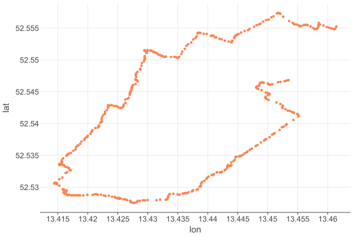

### Step 4 — Overlay on Berlin district boundaries

[`Step_4_Vizualize_one_track_with_Berlin_area.kt`](https://github.com/zaleslaw/Geo-Analytics-KotlinConf-2026/blob/master/src/main/kotlin/onetrack/Step_4_Vizualize_one_track_with_Berlin_area.kt)

```kotlin
val berlinBezirke = GeoDataFrame.readShapefile(BERLIN_SHAPEFILE_PATH)
val wgs84Crs = CRS.decode("EPSG:4326", true)
val berlinWgs84 = berlinBezirke.applyCrs(wgs84Crs)

berlinWgs84.plot {
    geoPolygon()
    withData(geoDataFrame) {
        geoPoints { size = 1.5 }
    }
}.save("berlinBezirke_${ONE_TRACK_FILENAME}.png")
```

The shapefile stores district boundaries in Web Mercator projection (EPSG:3857). The `applyCrs` call reprojects them to WGS84 so both layers share the same coordinate system.

| Berlin districts | Track on map |
|:---:|:---:|
| 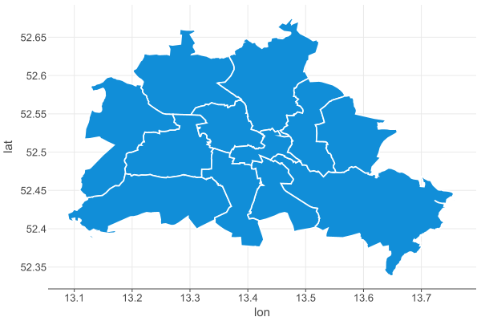 | 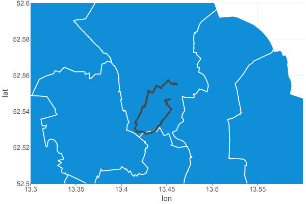 |

### Step 5 — Compute distances and statistics

[`Step_5_Enrich_one_track.kt`](https://github.com/zaleslaw/Geo-Analytics-KotlinConf-2026/blob/master/src/main/kotlin/onetrack/Step_5_Enrich_one_track.kt)

```kotlin
val enrichedDf = gpxDf.addDistanceColumns()
enrichedDf.printDistanceStatistics()
```

[`addDistanceColumns()`](https://github.com/zaleslaw/Geo-Analytics-KotlinConf-2026/blob/master/src/main/kotlin/analysis/TrackAnalysis.kt#L8) calculates the distance between each consecutive pair of GPS points and adds three columns: `haversineDistance`, `euclideanDistance`, and `distanceDelta`.

**Haversine formula** — the standard way to compute great-circle distance on a sphere:

```
a = sin²(Δlat/2) + cos(lat₁) · cos(lat₂) · sin²(Δlon/2)
d = 2R · arctan2(√a, √(1−a))
```

where R = 6,371,000 m. For a walking GPS track the distances between consecutive points are small (under 10 m), so Haversine and Euclidean give nearly identical results. The difference (`distanceDelta`) is printed for comparison and is typically under 0.01%.

The Euclidean approximation projects coordinates onto a flat plane, correcting for longitude compression at higher latitudes by scaling `Δlon` by `cos((lat₁+lat₂)/2)`. It is faster to compute but accumulates error over long distances or near the poles.

Sample output:
```
Total distance : 4.23 km
Avg point gap  : 0.42 m
Max point gap  : 8.31 m
```

---

## Part 2: Multiple Tracks

Source files: `src/main/kotlin/multipletracks/`

This section loads all GPX files at once and builds aggregate visualizations.

### Step 1 — Load all GPX files

[`Step_1_Export_GPX_tracks.kt`](https://github.com/zaleslaw/Geo-Analytics-KotlinConf-2026/blob/master/src/main/kotlin/multipletracks/Step_1_Export_GPX_tracks.kt)

```kotlin
val tracksDf = File(TRACKS_PATH)
    .listFiles { f -> f.extension.equals("gpx", ignoreCase = true) }
    ?.map { file ->
        DataFrame.readGPX(file.absolutePath)
            .add("filename") { file.name }
            .addDistanceColumns()
    }
    ?.reduce { acc, df -> acc.concat(df) }
```

Each file is parsed independently (distance calculation requires consecutive points within one track), then all DataFrames are concatenated into a single table with a `filename` column for grouping.

### Step 2 — Visualize all tracks on a map

[`Step_2_Vizualize_tracks.kt`](https://github.com/zaleslaw/Geo-Analytics-KotlinConf-2026/blob/master/src/main/kotlin/multipletracks/Step_2_Vizualize_tracks.kt)

All tracks plotted together show the geographic coverage of the dataset.

| All tracks | Filtered to Berlin | With district layer | Zoom: Pankow & Mitte |
|:---:|:---:|:---:|:---:|
| 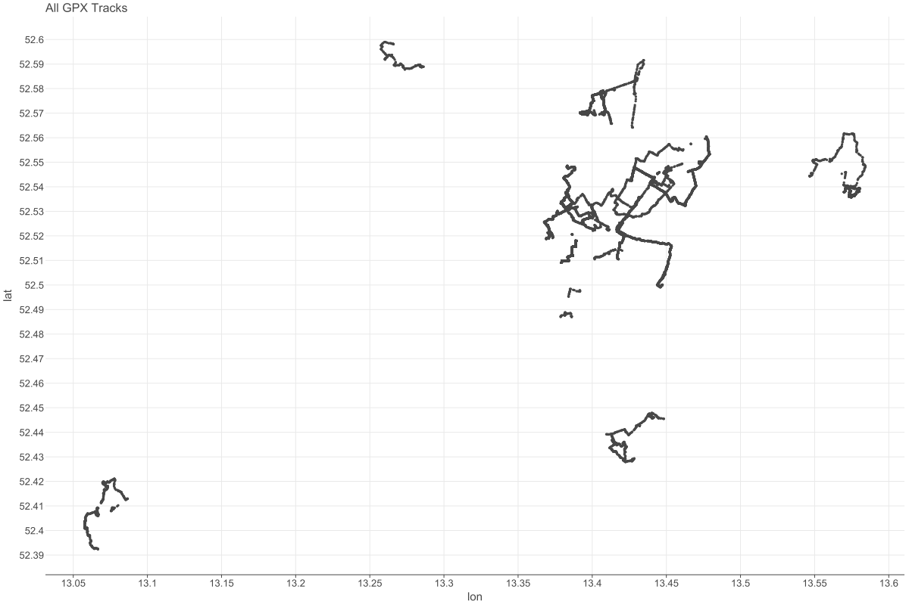 | 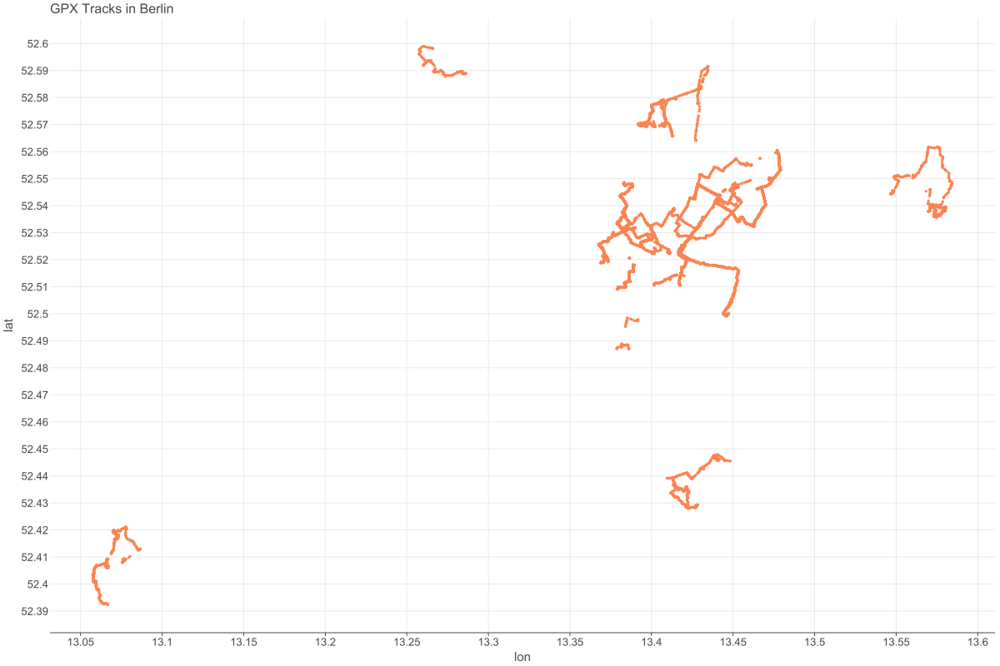 | 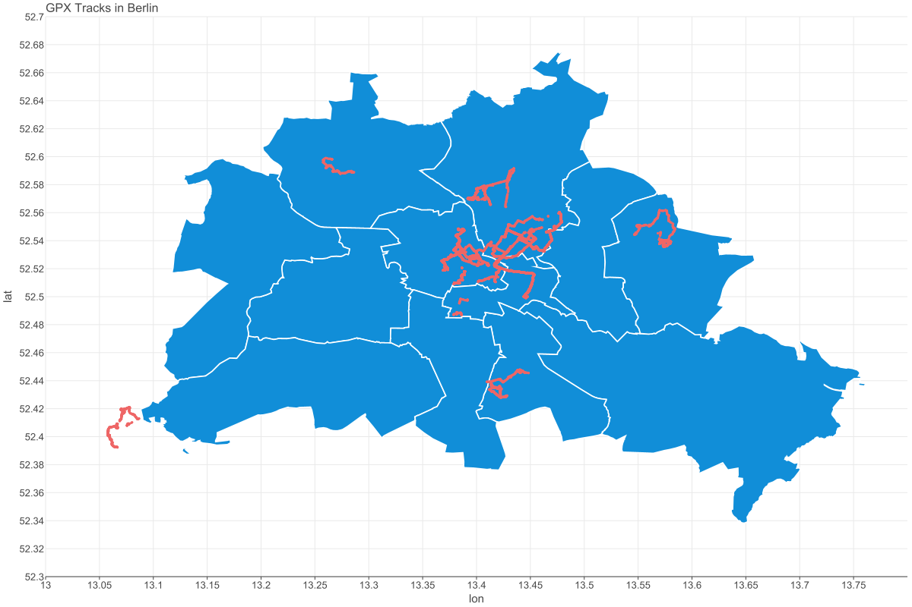 | 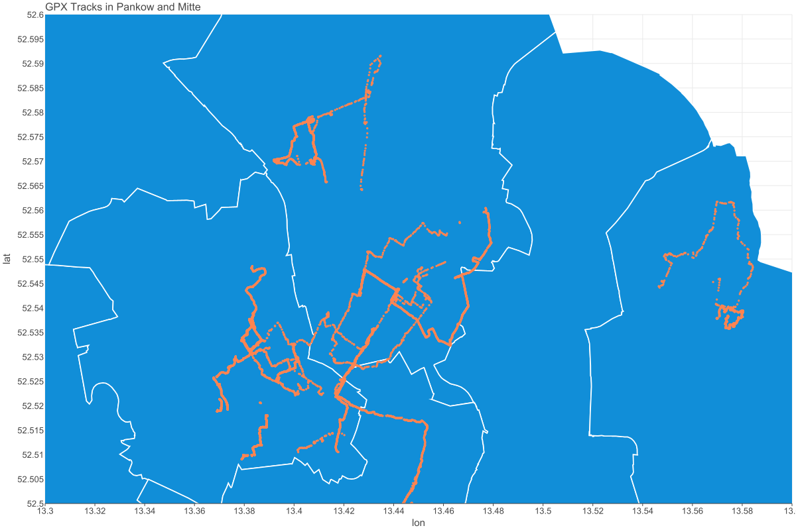 |

### Step 3 — Temporal analysis

[`Step_3_Temporal_Analysis.kt`](https://github.com/zaleslaw/Geo-Analytics-KotlinConf-2026/blob/master/src/main/kotlin/multipletracks/Step_3_Temporal_Analysis.kt)

```kotlin
val temporalDf  = tracksDf.addTemporalAttributes()   // hour, day, month, season
val trackStats  = temporalDf.addSpeedMetrics().calculateTrackStats()

trackStats.visualizeDurationByMonth("multipleTracks/duration_by_month.png")
trackStats.visualizeDurationByHour ("multipleTracks/duration_by_hour.png")
```

[`addTemporalAttributes()`](https://github.com/zaleslaw/Geo-Analytics-KotlinConf-2026/blob/master/src/main/kotlin/analysis/TemporalAnalysis.kt#L10) parses ISO 8601 timestamps and adds derived columns: `hour_of_day`, `day_of_week`, `month`, `year`, `season`.

[`calculateTrackStats()`](https://github.com/zaleslaw/Geo-Analytics-KotlinConf-2026/blob/master/src/main/kotlin/analysis/TemporalAnalysis.kt#L97) collapses the point-level table into one row per track: start time, total distance, total duration, average speed.

| Walk duration by month | Walk duration by hour of day |
|:---:|:---:|
| 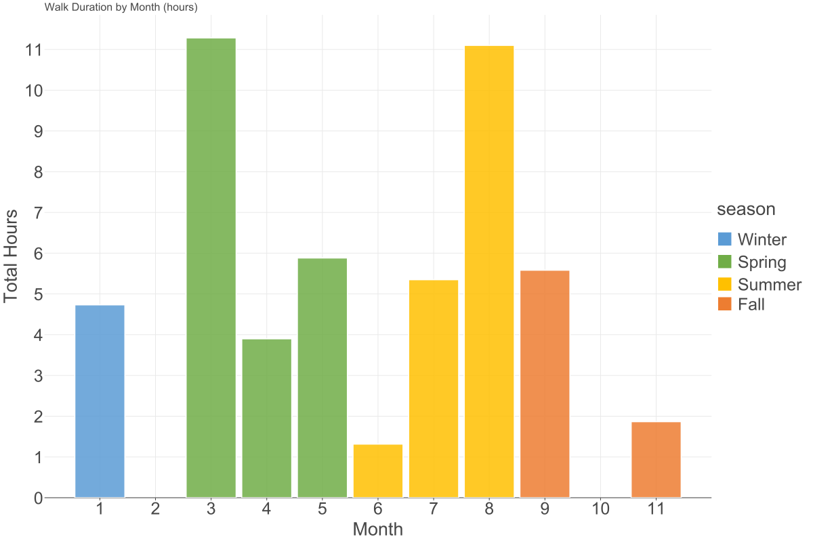 | 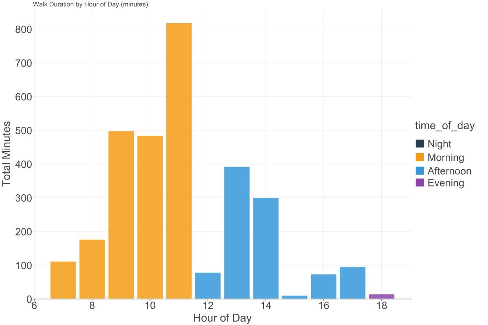 |

### Step 4 — Clean GPS noise

[`Step_4_Cleanup_data.kt`](https://github.com/zaleslaw/Geo-Analytics-KotlinConf-2026/blob/master/src/main/kotlin/multipletracks/Step_4_Cleanup_data.kt)

Raw GPS data contains measurement errors — sudden position jumps that produce unrealistic speed values. Two algorithms are demonstrated:

**Algorithm A — distance jump filter**

```kotlin
val cleanedA = pointsDf.filter { "haversineDistance"<Double>() < 100.0 }
```

A GPS ping that jumps more than 100 m from the previous point is satellite noise, not walking. These rows are dropped.

**Algorithm B — time-interval aggregation**

```kotlin
val smoothedB = pointsDf.aggregatePointsByTime(intervalSeconds = 10)
```

[`aggregatePointsByTime`](https://github.com/zaleslaw/Geo-Analytics-KotlinConf-2026/blob/master/src/main/kotlin/analysis/SmoothedAnalysis.kt#L19) works in two phases.

**Phase 1 — windowing.** Points are sorted by timestamp per track. A sliding window of `intervalSeconds` seconds (default 10) is opened at the first point of each track. Every point whose timestamp falls within the window is collected; when a point falls outside, the window closes, the collected points are aggregated, and a new window opens. Aggregation per window:
- `lat`, `lon`, `altitude` — arithmetic mean of all points in the window
- `datetime` — timestamp of the first point in the window
- `point_count` — number of raw GPS measurements in the window

**Phase 2 — distance recalculation.** Summing raw `haversineDistance` values within a window inflates the result, because every small GPS jitter adds positive distance. Instead, after averaging positions, the distance for each interval is recalculated from scratch:

```
distance[i] = haversine(avgLat[i-1], avgLon[i-1], avgLat[i], avgLon[i])
speed[i]    = distance[i] / timeBetweenIntervalStarts[i] × 3.6
```

Noise that averages out in position does not contribute to reported speed. Genuine displacement between windows is preserved.

| Raw speed distribution | After Algorithm A | After Algorithm B |
|:---:|:---:|:---:|
|  | 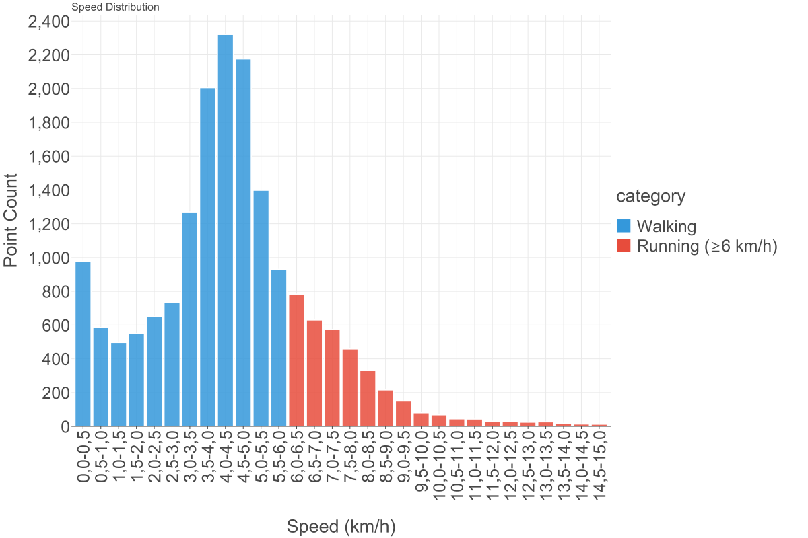 | 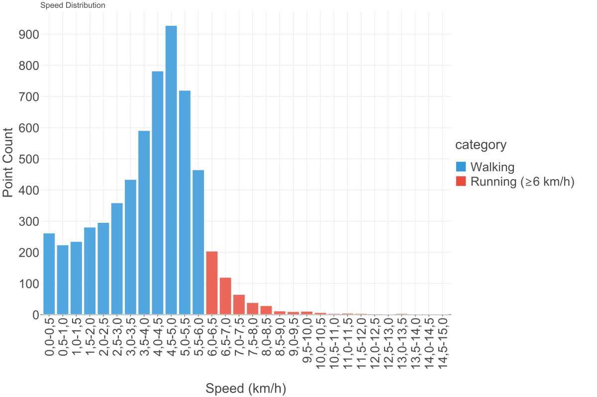 |

The long tail on the right in the raw chart represents noise. Both algorithms remove most of it. Algorithm B also preserves more real low-speed data (standing, slow walking) because it averages rather than discards.

### Step 5 — Enrich with weather data

[`Step_5_Enrich_with_Weather.kt`](https://github.com/zaleslaw/Geo-Analytics-KotlinConf-2026/blob/master/src/main/kotlin/multipletracks/Step_5_Enrich_with_Weather.kt)

```kotlin
val weatherService = WeatherService()
val enrichedDf = pointsDf.enrichWithWeather(weatherService, useCache = true)

val trackWeather = enrichedDf.aggregateWeatherByTrack()
val combined     = trackStats.innerJoin(trackWeather, "filename")
```

`WeatherService` calls the [Open-Meteo](https://open-meteo.com) historical weather API — free, no API key required. It fetches hourly temperature, precipitation, wind speed, cloud cover, and weather code for each track's location and time.

Results are cached in `weather_cache.csv` (keyed by lat, lon, date, hour), so repeated runs do not make redundant API calls.

[`aggregateWeatherByTrack()`](https://github.com/zaleslaw/Geo-Analytics-KotlinConf-2026/blob/master/src/main/kotlin/weather/WeatherEnrichment.kt#L131) collapses point-level weather into one row per track: numeric values are averaged, weather category is determined by the dominant condition.

| Walks by weather | Walks by month and weather | Weather heatmap |
|:---:|:---:|:---:|
| 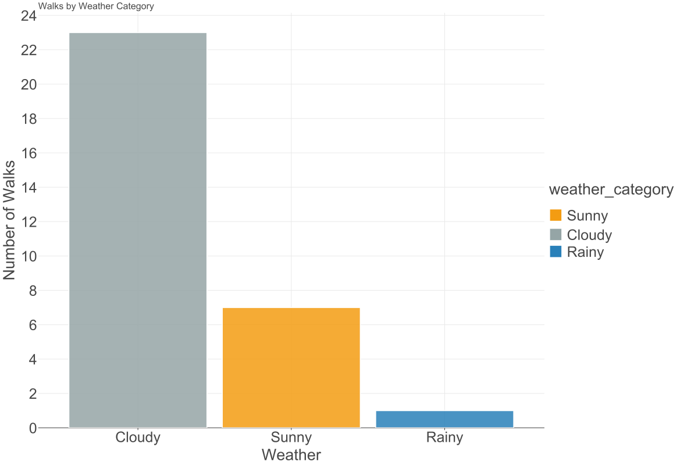 | 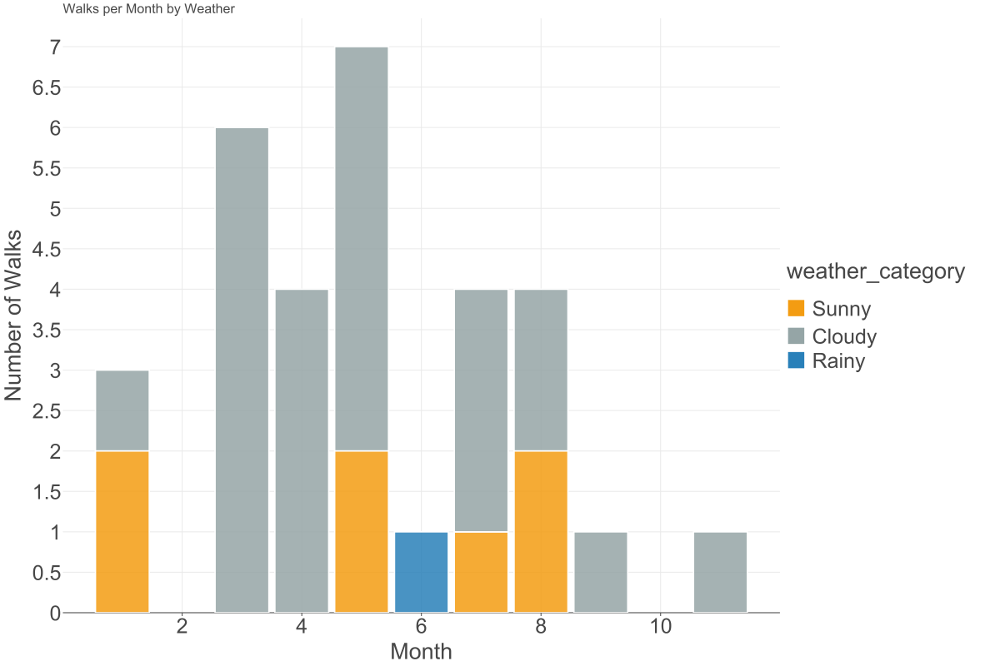 | 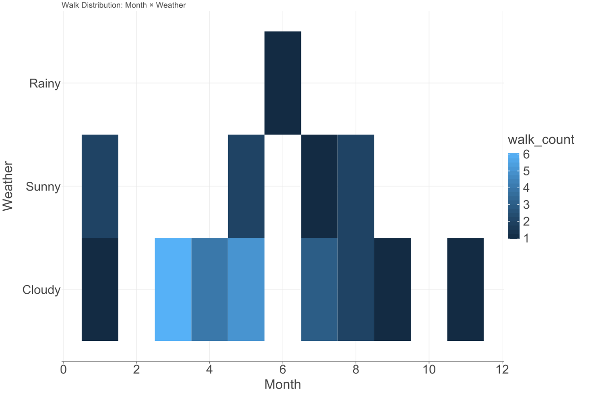 |

| Average temperature by month | Temperature vs walk duration |
|:---:|:---:|
| 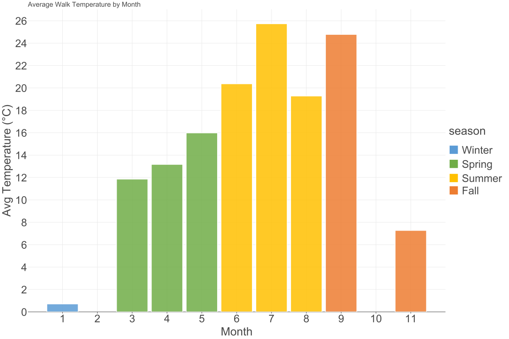 | 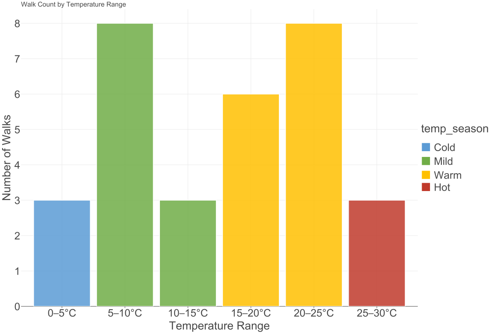 |

### Step 6 — Generate a smooth heatmap

[`Step_6_SmoothHeatmap.kt`](https://github.com/zaleslaw/Geo-Analytics-KotlinConf-2026/blob/master/src/main/kotlin/multipletracks/Step_6_SmoothHeatmap.kt)

```kotlin
berlinPoints.createSmoothHeatmap(
    berlinGeoDataFrame = berlinWgs84,
    xRange     = 13.08..13.73,
    yRange     = 52.34..52.67,
    resolution = 200,
    blurMeters = 450.0,
    blurPasses = 3,
    outputPath = "$dir/heatmap_smooth_berlin_full.png",
    title      = "Walk Heatmap (smooth) — Berlin"
)
```

The heatmap algorithm has four stages.

**Stage 1 — binning.** The bounding box is divided into a `resolution × resolution` grid. Each GPS point is mapped to a cell `(i, j)` by linear interpolation of its coordinates into the grid index range. The cell's counter is incremented.

**Stage 2 — Gaussian blur via repeated box filters.** A true Gaussian blur requires convolving with a kernel whose weights follow `exp(−x²/2σ²)`. For large kernels this is expensive. Instead, the project applies three passes of a simple box blur (uniform moving average) along each axis. By the Central Limit Theorem, repeated convolution with a uniform distribution converges to a normal distribution:

```
1 pass  → rectangular (uniform) response
2 passes → triangular (tent) response
3 passes → close to Gaussian
```

The blur radius in grid cells is derived from `blurMeters` and the physical cell size:

```
cellSizeMeters = (lonSpan in km × 1000) / resolution
blurRadius     = round(blurMeters / cellSizeMeters)
```

Because longitude lines converge at higher latitudes, the cell size in the east–west direction is adjusted by `cos(centerLat)` to keep the blur physically isotropic. The box blur is applied separably: first along rows, then along columns, which reduces the cost from O(n²·k²) to O(n²·k).

**Stage 3 — log normalization.** Raw counts are compressed with `log(1 + count)`. This prevents a few heavily-walked streets from saturating the color scale and makes lightly-walked routes visible.

**Stage 4 — rendering.** Each non-zero cell is converted to a JTS polygon and colored on a gradient: blue (cold) → cyan → green → yellow → orange → red (hot). Cells with zero count are left transparent so the underlying district boundaries show through.

The same data at three zoom levels:

| Berlin full | Mitte & Prenzlauer Berg | Mitte street level |
|:---:|:---:|:---:|
| 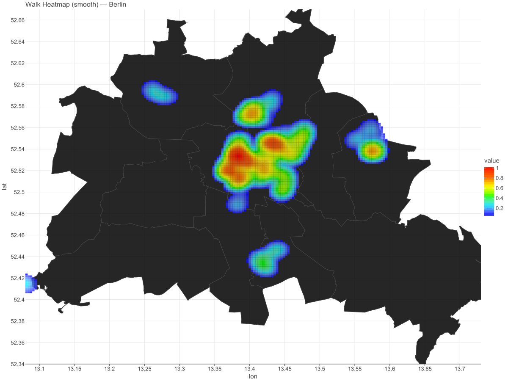 | 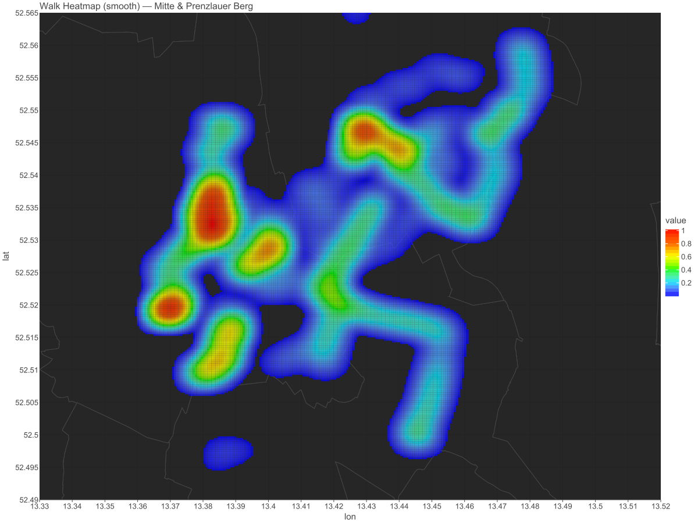 | 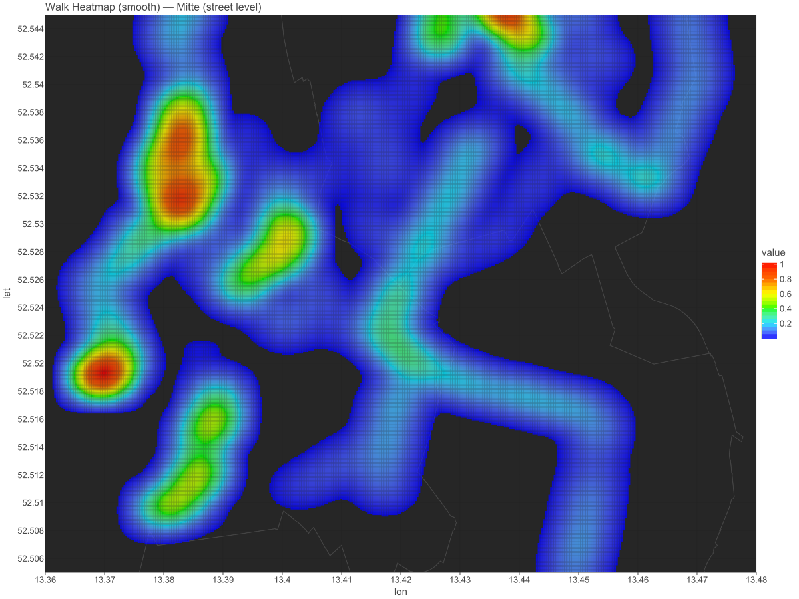 |

---

## Libraries used

| Library | Purpose |
|---------|---------|
| [Kotlin DataFrame](https://kotlin.github.io/dataframe/) | Tabular data manipulation |
| `dataframe-geo` | GeoDataFrame, shapefile reader, CRS reprojection |
| [Kandy](https://kotlin.github.io/kandy/) | Visualization DSL (grammar of graphics) |
| `kandy-geo` | Geographic plot layers (`geoPoints`, `geoPolygon`) |
| [JTS](https://locationtech.github.io/jts/) | Geometry engine (Point, Polygon, spatial operations) |
| [GeoTools](https://geotools.org) | Coordinate reference system decoding and projection |
| [Ktor](https://ktor.io) | Async HTTP client for weather API calls |
| [kotlinx-datetime](https://github.com/Kotlin/kotlinx-datetime) | Date/time parsing and arithmetic |
| [Open-Meteo](https://open-meteo.com) | Free historical weather API, no key required |

---

## Project structure

```
src/main/kotlin/
├── onetrack/          # Part 1: single track steps (Step_1 … Step_5)
├── multipletracks/    # Part 2: multiple tracks steps (Step_1 … Step_6)
├── analysis/          # Distance, speed, temporal, and cleanup functions
├── weather/           # WeatherService, cache, enrichment
├── visualization/     # Kandy chart builders
├── geo/               # GeoDataFrame conversion utilities
├── io/                # GPX parser
└── model/             # TrackPoint data class

src/main/resources/
├── tracks/            # 30+ GPX files (2023–2025, Berlin)
└── Berlin_Bezirke.*   # Berlin district boundary shapefile (ESRI format)
```
